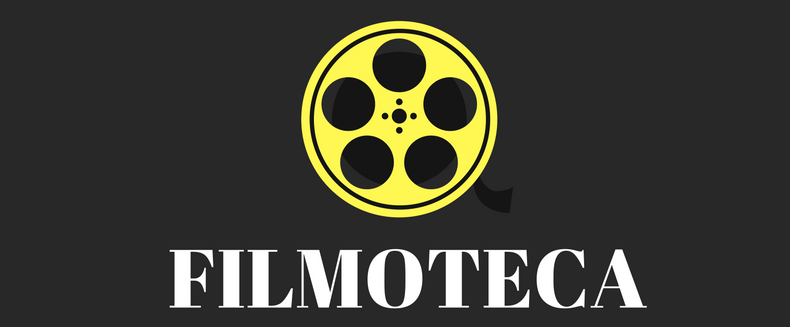
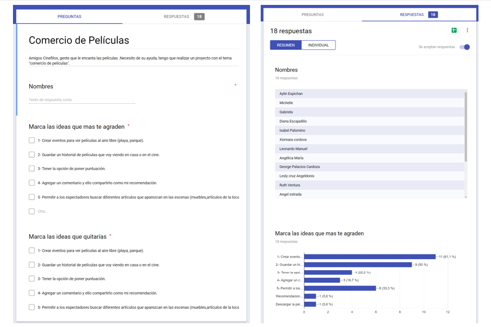
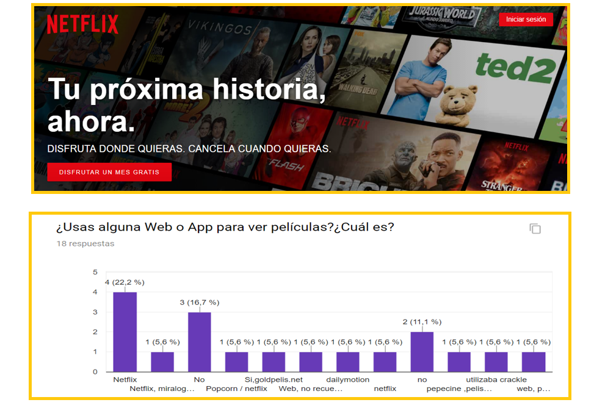
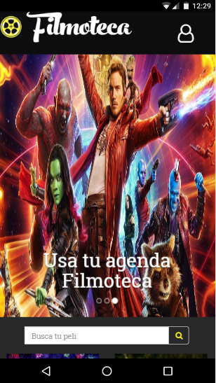
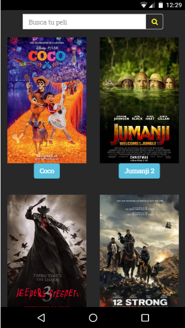
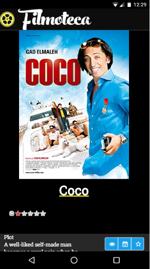
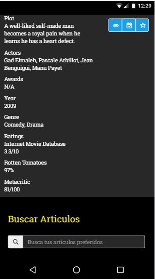
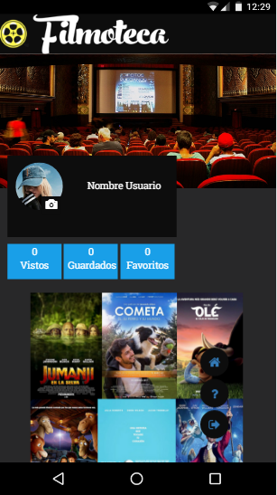

  
**Challenge Hackathon**  
### **Requerimientos**
Una web-App responsive con la temática "consumo de películas" en la cual creamos una solución utilizando el API de Open Movie Database.

### Organización

DIA 1 : ENTENDIENDO LAS NECESIDADES DEL USUARIO  
DIA 1 : ANÁLISIS DE LA COMPETENCIA  
DIA 1 : DEFINIR EL PRODUCTO MINIMO VIABLE  
DIA 2: SKETCH DE NUESTRO PROYECTO  
DIA 2 :  PATRONES DE INTERFAZ DE USUARIO (UI): COLORES NEGRO Y AMARILLO (SIMULA LA SENSACION DE ESTAR EN EL CINE.)  
DIA 3 : MAQUETACION WEB  
DIA 3 :  FUNCIONALIDAD  

### **Problematica**

Según las entrevistas que realizamos hay muchas personas que quieren tener un lugar en la Web o App para guardar sus películas favoritas.

### **Análisis de la competencia**
Netflix nuestra principal competencia no tenia esta opción (No le daba mucha importancia a esa necesidad ya que hay una opción en la que registran las películas vistas o seleccionadas pero no de manera detallada.)

## **Nuestro Producto**
Y así nació Filmoteca una Web-App en la cual ademas de buscar las películas que desees y ver su información podrás guardarlas en tu perfil de manera detallada,la cual te recuerda que películas has visto ,que películas has guardado para verlas después y cuales has marcado como favoritas. Y la podrás consultar cuando desees a su vez podrás consultar artículos de tus películas favoritas nosotros te ayudaremos con tu búsqueda.

Para ingresar a Filmoteca tienes que registrarte colocando tu nombre, correo y contraseña luego inicias sesión ,buscas tu películas favorita das click en la película ,y te enviaran a la vista en la cual podrás verificar la información comentar y marcar como guardado visto o favorito así tu información estará segura para consultarla después en tu perfil .

### Vistas

> vistas/Mobile

### Herramientas Tecnologicas  
- HTML5  
- CSS3  
- Jquery  
- JS  
- Framework Bootstrap
- Farebase (Autenticación)
- Axios
- API de Open Movie Database (OMDB)

### Integrantes  
- Estrella Benites
- Alejandra Hoces  
- Lidia Ramirez
